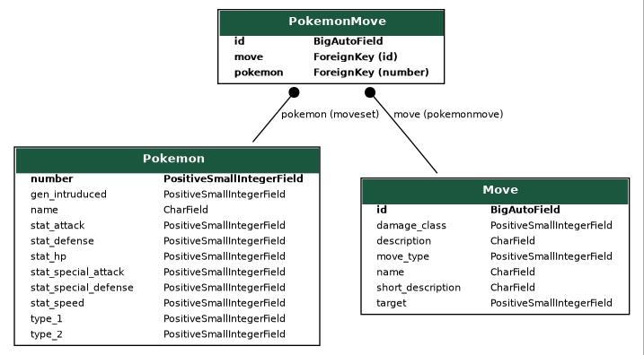

# Toy Project: DjangoDex

Criei um [projetinho](https://github.com/billyninja/djangodex) para criar exemplos pra essa apresentação, e quem sabe apresentação futuras.

A ideia é consumir a [PokéAPI](https://pokeapi.co/) para trazer dados de Pokémon e criar uma app em Django para explorar esses dados.

Obs: A PokéAPI também é feita em Django e [está no GitHub](https://github.com/PokeAPI/pokeapi), claro.

---

# O que é um ORM

É uma sigla para *Object–relational mapping*

Tenta mapear um sistema relacional para um sistema orientado a objetos.

Ou, de forma mais objetiva: é uma interface super conveniente ao banco de dados, que não só te dá acesso ao banco, como mapeia as entidades do esquema-relacional em objetos da linguagem de programação.

---

# A vida SEM um ORM

O melhor jeito de entender pra que serve um ORM é **não usar um ORM**.

Uma interface básica como o [psychopg2](https://pypi.org/project/psycopg2/) vai te fornecer métodos para: conectar ao banco, realizar queries e transações, e ainda te proteger SQL injections e outras vulnerabilidades.

Mas ele não infere muito mais que isso, **ainda bem!**(É sempre bom ter interfaces em níveis mais baixos para que abstrações de níveis mais alto possam ser construídas em cima)

**[RAW SQL]** -> Lista de Tuplas com seus valores

---

# A vida SEM um ORM

```python
result = cursor.execute("SELECT * FROM kbase_pokemon")`

("number", "name", type, introduced_gen, height, weight,)
[
    (1, "bulbassaur", 2, 1, 7, 7),
    (2, "ivyssaur", 2, 1, 9, 12),
    (3, "venossaur", 2, 1, 15, 50),
    ...
]
```

---

# A vida com um ORM

```python
Pokemon.objects.all()
```
`[<#1 Bulbassaur: grass>, <#2 Ivyssaur: grass>, <#3 Venossaur: grass>]`

Permite interagir com o banco de dados através de uma API,
geralmente mapeando classes em tabelas e objetos em registros.

É possível criar aplicações sabendo muito pouco do que acontece na camada do banco de dados (E talvez essa seja a primeira armadilha dos ORMs)

---

# O ORM do Django
*Django is a web-framework with batteries included*

O Django vem com o seu próprio ORM (outros fw preferem não se meter com isso, e deixam o usuário escolher se quer um ORM e qual)
Pra mim é um dos grandes atrativos do Django, é um ORM muito maduro e poderoso

---

# O que é um model do Django?
- É uma classe Python,
- Que tem como objetivo #1: definir como será o mapeamento `Python <> Banco de Dados` para uma tabela,
- Defina as entidades nos seus models, e o Django cria as tabelas e colunas no BD
    - através das *migrations*, que é um tópico pra outro dia
- Podemos relacionar os models, criando assim relacionamentos de chaves-estrangeiras no banco

> python manage.py graph_models kbase -o kbase_er.jpeg



---

# Distinção model x instance

A mesma de classe x objeto

*model* -> tabela

*instance* -> registro ou linha na tabela

---

# Debugging
- Let's keep an eye on those queries
- No `settings.py` do projeto
```python
LOGGING = {

    ...

    'loggers': {
        'django.db.backends': {
            'level': 'DEBUG',
            'handlers': ['console'],
        }
    }
```
---

# O manager .objects
- Por que ele existe?
- É possível estender para adicionar comportamentos especificos

```python

class MyCustomPokemonManager(models.Manager):

    def first_gen(self):
        return self.filter(gen_intruduced=1)


class Pokemon(models.Model):
    ...
    objects = MyCustomPokemonManager()


Pokemon.objects.first_gen().all()
```

---
# Mudando o *mindset*

Ter uma boa fluência no ORM é muito importante, pois acaba sendo uma forma muito rápida de investigar ou até remediar problemas em prod.

Quando se está desenvolvendo algo no Django, sempre tenha o shell_plus aberto, explore, experimente as queries antes de coloca-las no código.

---

# Level 01

Quero todos os pokémons!
> Pokemon.objects.all()

Qual é o primeiro pokémon?
> Pokemon.objects.first()

Qual é o último pokémon?
> Pokemon.objects.last()

Cade o Pikachu?
> Pokemon.objects.get(name__iexact="pikachu")

**Note que**: Algumas operações retornam um objeto, outras retornam um `QuerySet`

---

# Level 5

Qual pokémon tem maior HP?
> Pokemon.objects.all().order_by("stat_hp").last()

E o menor?
> Pokemon.objects.all().order_by("-stat_hp").fist()

Dentre os 3 iniciais algum tem tipo secundário (type_2)?
> Pokemon.objects.filter(number__in=[1, 4, 7], type_2__isnull=False).values("name", "type_2")

#### Note que vírgula é AND
`uma_condicao , outra_condicao` => `uma_condicao AND outra_condicao`

---

# Level 10
##### Um QuerySet expões as mesmas funções do manager (.objects), e isso possibilita o encadeamento de chamadas!

Quero os pokémons de Fogo, que não são Charmander (e suas evoluções)
> Pokemon.objects.filter(type_1=Type.FIRE.value).exclude(number__in=[4, 5, 6])

Quero que os fantasmas virem fadas!
> Pokemon.objects.filter(type_1=Type.GHOST.value).update(type_1=Type.FAIRY.value)

Você também pode fazer "slicing" em um QuerySet (é a forma de implementar LIMIT/OFFSET)

>Pokemon.objects.all()[6:9]
ou
>Pokemon.objects.all()[10:]
ou
>Pokemon.objects.all()[:10]

**(Mas não pode usar indices negativos!)**

E também tem suporte ao `step operator`

>Pokemon.objects.all()[::2]


---

# Level 15

Quero todos os pokémons que podem aprender Solar Beam!
> Pokemon.objects.filter(moveset__move__name="solar-beam")

Quero todos os pokémons que podem aprender Qqer Beam!
> Pokemon.objects.filter(moveset__move__name__endswith="-beam")

E qual deles tem Special mais alto?
> Pokemon.objects.filter(moveset__move__name="solar-beam").order_by("-stat_special_attack")[0]

Tirando os Pokemons super-raros.
> Pokemon.objects.filter(moveset__move__name="solar-beam", number__lte=143).order_by("-stat_special_attack")

---

# Level 15

Trazendo valores customizados (diferentes de uma instância da classe).

> Pokemon.objects.all().values('name', 'type_1', 'type_2')

> Pokemon.objects.all().values_list('name', 'type_1', 'type_2')

> Pokemon.objects.all().values_list('name', flat=True)

---

# Level 20
#### Q? \~Q?
Pokémons que tenham tipo água (como primeiro ou segundo tipo)
> Pokemon.objects.filter(Q(type_1=Type.WATER.value) | Q(type_2=Type.WATER.value))

Aqui começa a dar ruim (a expressividade e legibilidade)

Pokemons do tipo água que não conseguem aprender hydro-pump =(
```python
Pokemon.objects.filter(Q(
    Q(type_1=Type.WATER.value) | Q(type_2=Type.WATER.value)
) & ~Q(moveset__move__name="hydro-pump"))
```

Mas você pode armazenar os Q's em variáveis!

```python
type_clause = Q(Q(type_1=Type.WATER.value) | Q(type_2=Type.WATER.value))
move_clause = ~Q(moveset__move__name="hydro-pump")
Pokemon.objects.filter(type_clause & move_clause)
```

---

# Level 25
Pra falar verdade é bem simples, mas costuma ser dificil de achar situação pra usar
(no caso da loggi poderiamos usar para checar dimensões de um pacote)

Me mostre os glass cannons
> Pokemon.objects.filter(stat_attack__gte=F("stat_defense") * 2)

Pokemóns com todos os stats iguais:

```python
Pokemon.objects.filter(
    stat_attack=F("stat_defense"),
    stat_defense=F("stat_special_attack"),
    stat_special_attack=F("stat_special_defense"),
    stat_special_defense=F("stat_speed")
)
```

#### ! *I wild limitaçãozinha curiosa appears* !
Essa operação seria equivalente à acima, mas ela não é possível devido a restrições da expressividade do python (e a forma que o ORM tenta tirar proveito dela)

```python
Pokemon.objects.filter(
    stat_speed=F("stat_defense"),
    stat_speed=F("stat_special_attack"),
    stat_speed=F("stat_special_defense"),
    stat_speed=F("stat_attack")
)
```

# Level 30

>Pokemon.objects.all().aggregate(avg_hp=Avg('stat_hp'))

>Pokemon.objects.aggregate(diff=Max('stat_hp', output_field=FloatField()) - Avg('stat_hp'))


# Level 35

Annotate

```python
Pokemon.objects.annotate(
    summed_stats=F("stat_attack")
    + F("stat_defense")
    + F("stat_speed")
    + F("stat_special_attack")
    + F("stat_special_defense")
).order_by("-summed_stats").values("name", "summed_stats")
```

```python
Pokemon.objects.annotate(
    summed_stats=F("stat_attack")
    + F("stat_defense")
    + F("stat_speed")
    + F("stat_special_attack")
    + F("stat_special_defense")
).filter(summed_stats__gt=420).values("name", "summed_stats").order_by("-summed_stats")
```

---

# Level 40

Subqueries com anotações

```python
subq = PokemonMove.objects.filter(
    pokemon_id=OuterRef("number"),
    move__accuracy=100,
    move__power__gt=115,
    move__priority=0,
).values_list("move__name", flat=True)

res = Pokemon.objects.annotate(
    summed_stat=F("stat_attack")
    + F("stat_defense")
    + F("stat_speed")
    + F("stat_special_attack")
    + F("stat_special_defense"),
    desired_moves=subq
).filter(stat_speed__gt=80, desired_moves__isnull=False).values("name", "desired_moves")
```

Esse é um bom exemplo para ver o funcionamento lazy-loading e o porquê dele.


---


# Common pitfalls

(Não deu tempo, então é só falar com a boca)
